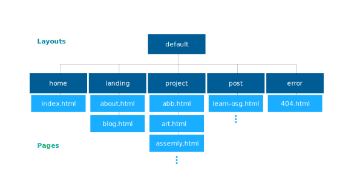

# Prateek Sahay's Personal Website #
Welcome to the source code of my personal website! I developed this website to
archive my favorite projects and write about my thoughts. The initial versions
of my site from 2011 were written by hand on top of [Twitter's
Bootstrap](https://getbootstrap.com/), but I ported it to
[Jekyll](https://jekyllrb.com/), a static website generator, in 2018 so I could
add a blog.

The static website generation comes with many other benefits, most of which
allowed me to consolidate duplicated code. However, rather than rely on one of
the many free and open-source Jekyll templates, I decied to write my own custom
layouts and styling. The styling is written in Sass, which has built-in support
in Jekyll.

My website is hosted at prateeksahay.com, psahay.com, and ptkinvent.github.io.

## Directory Layout ##
The layout of the directories is as follows:
```
.
├── css/       # Top-level passthrough Sass files
├── img/       # All images
├── _includes/ # Reusable blocks of code
├── js/        # JavaScript
├── _layouts/  # HTML layouts
├── _posts/    # HTML blog post contents
├── _scss/     # Actual Sass stylesheets
└── _site/     # Jekyll's compiled website
```

Note that the directories with underscores will not have compiled counterpart
directories, i.e. there will only be `css/`, `js/`, and `img/` directories in
the Jekyll-generated site.

### Styling Layout ###
Note that all styling information is kept inside `_scss/`, even though there are
Sass files in `css/`. This is because Jekyll treats Sass files the same as HTML
files---meaning the generated files are placed in the same directory in the
output. In addition, the top-level Sass files need to have two sets of triple
dashes to be recognized by Jekyll, which can lead to some wonky syntax
highlighting. For these reasons, all the actual styling information is placed
inside `_scss/`, which Jekyll treats as a location for storing Sass partials.
The primary benefit of this layout is that it keeps styling information in one
directory rather than spread across two.

### HTML Layout ###
The HTML lives at the top level of the directory and is supported by a system of
layouts. All layouts 'inherit' from a base layout called default. There are five
custom-defined layouts, and each page subscribes to one of these layouts to
afford consistent styling across the site, as shown in the figure below.




## Dependencies ##
Make sure you have the development version of Ruby 2.25 or above installed with
`ruby -v`. If not, run:
```sh
sudo apt install ruby-dev
```

Then, run
```sh
gem install sass jekyll bundler
```


## Build and Run ##
To compile the various layouts and content into complete pages, run
```
bundle install           # Install any missing gems
bundle exec jekyll build # Optionally add --destination <path/to/destination>
```

Optionally, Jekyll can serve you the generated website locally. Run
```
bundle exec jekyll serve # Start a local server on localhost:4000
```
